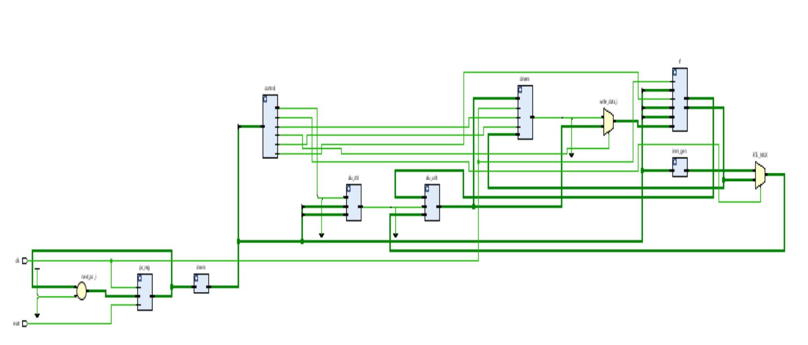
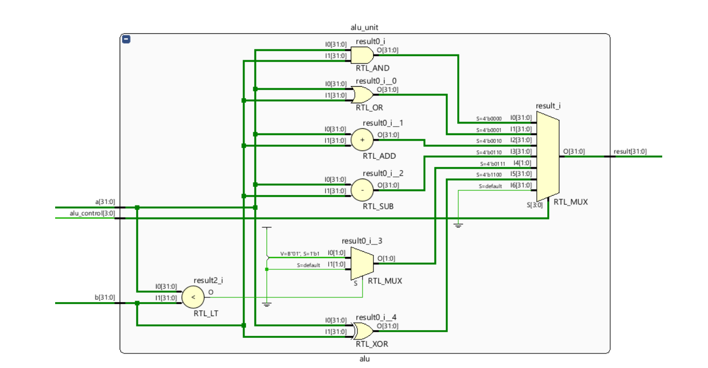
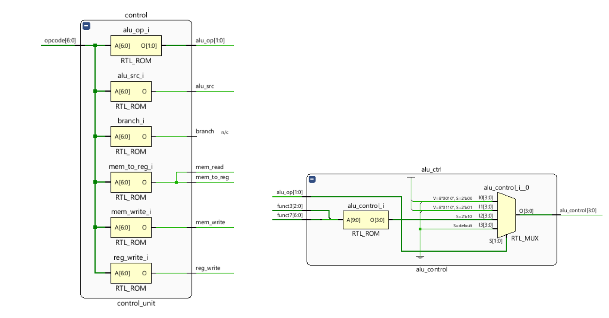
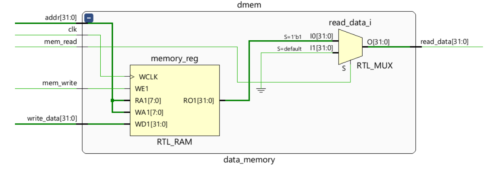
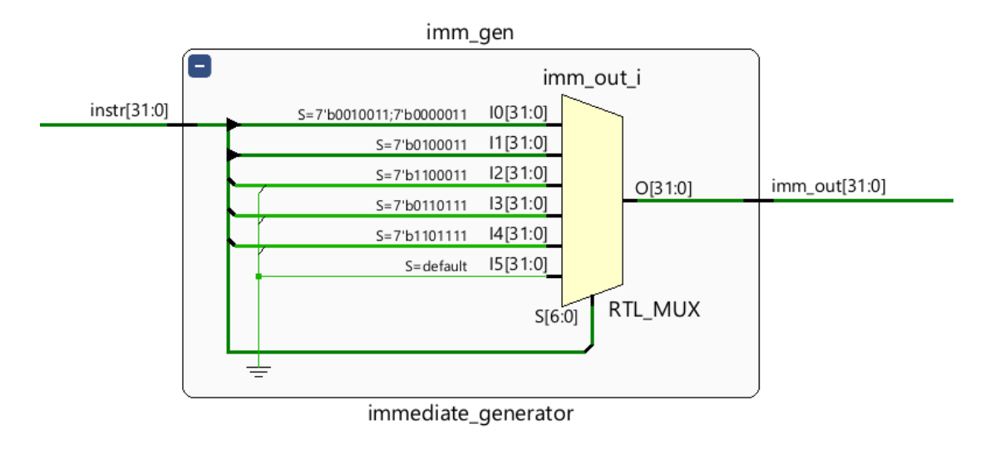
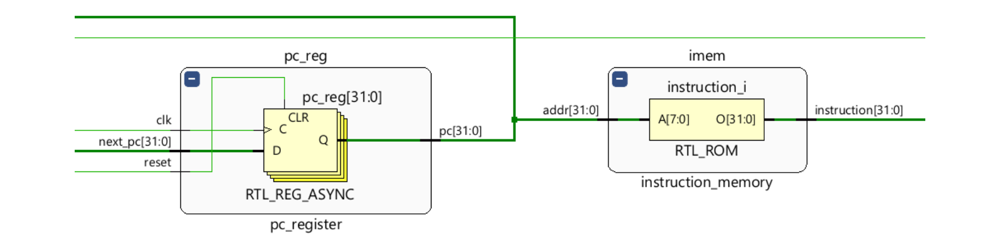
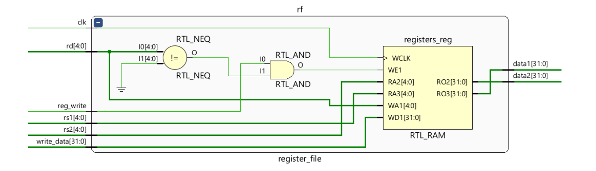
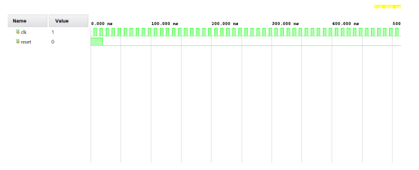

# RISC-V Single Cycle Processor

A modular **SystemVerilog** implementation of a **Single-Cycle RISC-V Processor** (RV32I subset).

---

## 📖 Overview
This repository provides a complete single-cycle CPU architecture for the **RISC-V RV32I instruction set**.

It organizes all major modules—**instruction memory**, **register file**, **ALU**, **control units**, **testbench**—using a clean educational structure, with supporting schematics and simulation screenshots.

### ✅ Supported Instruction Types
- **R-type**: `add`, `sub`, `and`, `or`
- **I-type**: `addi`, `lw`
- **S-type**: `sw`
- **B-type**: `beq`
- **U-type**: `lui`
- **J-type**: `jal`

> Designed for **learning, simulation,** and as a base for further extension (pipelining, hazards, etc.).

---

## 📂 Directory Structure

riscv-single-cycle-processor/
├── .vscode/                   # 🗂️ Editor settings (optional)
├── rtl/                       # 🗂️ SystemVerilog RTL source files
│   ├── riscv_core.sv
│   ├── pc_register.sv
│   ├── instruction_memory.sv
│   ├── register_file.sv
│   ├── immediate_generator.sv
│   ├── alu.sv
│   ├── data_memory.sv
│   ├── control_unit.sv
│   └── alu_control.sv
├── testbench/                 # 🗂️ Testbench code
│   └── tb_riscv_core.sv
├── schematic/                 # 🗂️ Block diagram screenshots
│   ├── alu.png
│   ├── alu_control.png
│   ├── data_mem.png
│   ├── imm_generator.png
│   ├── pc_instuction_mem.png
│   ├── reg_file.png
│   └── schematic.png
├── simulation/                # 🗂️ Simulation waveform/output screenshots
│   └── simulation_image.png
├── .gitignore
├── LICENSE
└── report.pdf                 # 📄 Full project report

---

## 🚀 How to Use

### **1. Open RTL Design Files**
All main CPU modules are in the `rtl/` folder.

### **2. Run Simulation**
Use a Verilog/SystemVerilog simulator such as **Icarus Verilog**, **Vivado**, or **ModelSim**.  
Compile and simulate the testbench in:
testbench/tb_riscv_core.sv

### **3. View Schematics & Simulation**
- **Schematics**: `schematic/`
- **Simulation Outputs**: `simulation/`

### **4. Read Documentation**
See **`report.pdf`** for complete theory, code listing, diagrams, and discussion.

---

## 🖼️ Block Diagram & Schematics
### Full Processor Schematic

### Module-Level Schematics
**ALU**

**ALU Control**

**Data Memory**

**Immediate Generator**

**PC & Instruction Memory**

**Register File**

---

## 📊 Simulation Result

---

## 💡 Features
- **Modular & Readable RTL**: Each hardware function in its own file.
- **RV32I Instruction Subset**: Basic arithmetic, logic, load, store, branch, and jump instructions.
- **Simulation & Verification**: Structured testbench included.
- **Visuals**: Schematic and simulation result images for clarity.
- **Clean Documentation**: Organized folders and files.

---

## 📌 Applications
- Computer Architecture and VLSI/FPGA Labs  
- Educational RISC-V CPU prototyping  
- Foundation for pipelined/multi-cycle CPUs  
- Embedded systems R&D  

---

## ✅ Advantages
- Modular, scalable, and synthesizable design  
- Easily extendable for more instructions/features  
- Instruction-driven, educational focus  

---

## ⚠️ Limitations
- No hazard detection or data forwarding  
- Performance limited by single-cycle design  
- Supports only basic RV32I instructions  

---

## 🏆 Credits
Developed and documented by **Nandini Agarwal**  
*(GLA University, B.Tech EC - VLSI)*

---

## 📜 License
Distributed under the terms in the [LICENSE](LICENSE) file.

---

## 🤝 Contributions
For questions, collaboration, or improvements:  
Please create an **issue** or submit a **pull request**.
